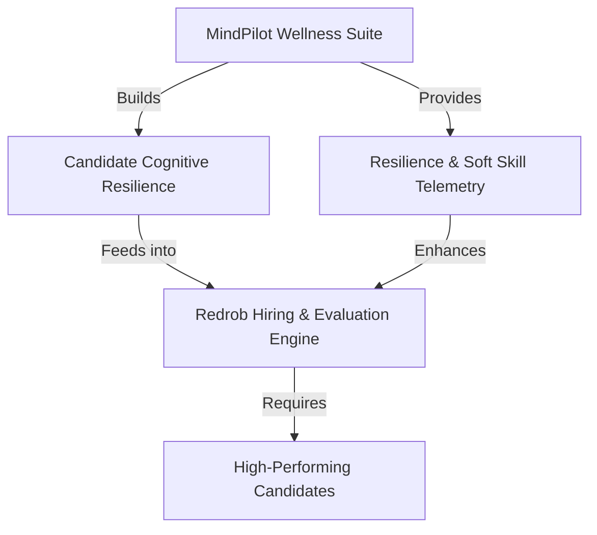
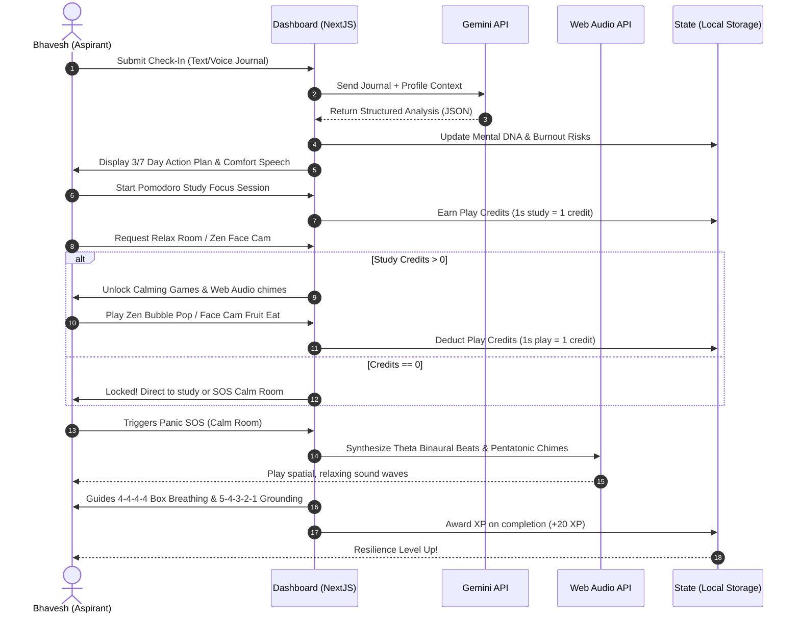
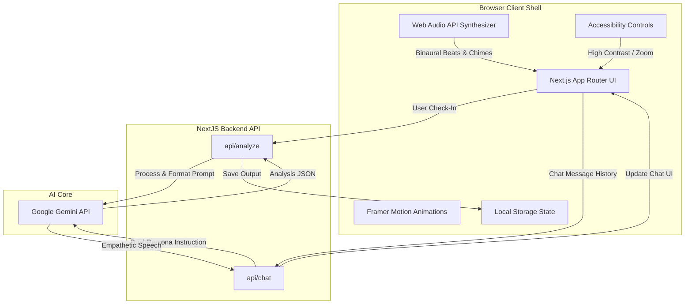

# Slide 1: Front Page (Title Slide)

---

```
  __  __ _           _ ____  _ _       _          _ ___ 
 |  \/  (_)_ __   __| |  _ \(_) | ___ | |_       / |   \
 | |\/| | | '_ \ / _` | |_) | | |/ _ \| __|______| | |) |
 | |  | | | | | | (_| |  __/| | | (_) | |_|______| |  _/ 
 |_|  |_|_|_| |_|\__,_|_|   |_|_|\___/ \__|      |_|_|   
                                                        
               EXAM RESILIENCE SUITE
```

## **MindPilot AI: Personalized AI-Driven Exam Resilience Suite**
*Navigating the Mental Marathon of High-Stakes Competitive Exams*

### **Track**
Mental Wellness & Student Support

### **Team Name**
SuperNeuralNexus

### **Presenter / Team Lead**
- **Bhavesh** (Fullstack AI Engineer & Architect)

### **Key Highlights of the System**
* **Circadian-Synced Schedule Calibration**: Optimizing study hours against sleep debt.
* **Dual-Persona AI Copilot**: Empathetic Mother ("Mom") care + relatable "Best Friend" study coaching.
* **SOS Calm Room**: Client-side synthesized Web Audio binaural beats and box breathing guide.
* **Gamified Anti-Distraction Engine**: Calming games locked behind Pomodoro study-earned credits.

---

# Slide 2: Redrob Context & Ideathon Scope

---

## **Strengthening the Redrob Ecosystem**
Redrob is establishing an AI-native ecosystem spanning hiring, productivity, workflows, and intelligent user experiences. MindPilot AI introduces a critical value layer focusing on **mental resilience and cognitive optimization** at the source: the candidate pipeline.



### **1. Improve Experiences for Redrob Users**
* Reduces test-taking anxiety during intensive hiring assessments.
* Keeps developers and students in peak focus states using structured circadian rhythms.

### **2. Introduce New Capabilities**
* Leverages advanced LLMs to extract emotional states and stress triggers from unstructured developer logs or student study diaries.
* Introduces a **Student/Candidate Mental DNA profile** mapping coping and recovery styles.

### **3. Extend Existing Redrob Capabilities**
* Complements Redrob's skill testing tools with an active mental safety net, transforming evaluation from a stressor into a supportive growth loop.

### **4. Strengthen Ecosystem Network Effects**
* Builds early-stage brand loyalty by supporting students during preparation, ensuring they transition into Redrob's recruitment network as resilient candidates.

---

# Slide 3: Submissions Focus - Leverage & Value

---

## **Why MindPilot AI is Uniquely Positioned on Redrob**

```
+-------------------------------------------------------------------------------+
|                             THE REDROB VALUE CHAIN                            |
|                                                                               |
|   Candidate Onboarding  -->  Preparation & Skill-Up  -->  Recruitment & Hire  |
|         (Redrob Profile)        (MindPilot AI Suite)       (Redrob Diagnostics) |
+-------------------------------------------------------------------------------+
```

### **How the Idea Leverages Existing Redrob Infrastructure**
* **Identity and Profiles**: Seamlessly integrates with the Redrob user profile database.
* **Analytical Engine**: Fits into Redrob's standard telemetry pipelines, transforming unstructured activity and text inputs into predictive indicators of performance risk.

### **What New Capability is Introduced?**
* **Biomedical & Cognitive Telemetry**: Introduces algorithms mapping sleep hours, cortisol/stress factors, and study habits directly to study retention rates.
* **Gamified Anti-Screen Addiction**: Restricts access to stress-buster camera filters using credits earned through core study sessions, enforcing productive boundaries.

### **Why Redrob is Uniquely Positioned to Enable This**
* Redrob acts as the bridge between study/training and employment. By holding data on both academic preparation (MindPilot) and hiring assessments, Redrob can build predictive models matching candidates' emotional resilience to job success.

---

# Slide 4: Team Introduction

---

## **SuperNeuralNexus Team Profile**

```
               [ Team Name: SuperNeuralNexus ]
  +-------------------------------------------------------+
  |  Bhavesh                                              |
  |  Role: Fullstack AI Architect & Lead Engineer          |
  |  Focus: Gemini Orchestration, State Machinery,       |
  |         Web Audio DSP, and Gamified Frameworks        |
  +-------------------------------------------------------+
```

### **Problem Statement Addressed**
Students preparing for hyper-competitive exams (like JEE, NEET, UPSC, GATE) suffer from chronic stress, extreme sleep deprivation, and lack of mental health resources. This results in **cognitive overload (high marks lost to silly mistakes)**, massive burnout, and a critical crisis of student self-harm.

### **Our Mission**
To build a highly interactive, scientifically backed, gamified software suite that serves as a safe psychological harbor, helping students optimize their schedule, build emotional resilience, and reduce exam-day panic.

---

# Slide 5: Problem We Want To Solve

---

## **The Silent Crisis in High-Stakes Academic Preparation**

```
   [ Daily Action ]                 [ Biological Impact ]             [ Academic Result ]
 11 Hours Study/Day  ===>  Cortisol Overload & Sleep Debt  ===>  Retention drops below 45%
 5.5 Hours Sleep/Day ===>  High Cognitive Fatigue          ===>  Silly errors & mock panic
```

### **1. What everyday challenge are we addressing?**
Students attempt to compensate for vast syllabi by cutting sleep and stretching study hours, inducing a state of chronic burnout. This triggers a negative cycle: high stress leads to poor memory retention, which yields poor mock test scores, compounding study anxiety.

### **2. Who faces this challenge?**
* Millions of high-school and college-level aspirants facing hyper-competitive testing formats.
* In student hubs (e.g., Kota), students face isolation, peer pressure, and intense parental tracking without healthy coping mechanisms.

### **3. Why does it matter?**
* **Retention Deficit**: Science proves study hours are wasted when sleep is severely restricted.
* **The Marks Deficit**: Unresolved anxiety and fatigue directly manifest as careless mistakes in exam conditions (e.g. marking wrong answers despite knowing the formula).
* **Extreme Clinical Risk**: Prolonged pressure without early intervention increases rates of severe clinical depression and panic disorders.

---

# Slide 6: Idea Overview

---

## **MindPilot AI: The Complete Exam Resilience Architecture**
MindPilot AI is a comprehensive wellness dashboard that addresses both schedule management and active stress relief.

```
                  +---------------------------------------+
                  |           MINDPILOT AI ENGINE         |
                  +---------------------------------------+
                  /                   |                   \
                 /                    |                    \
   +--------------------+   +-------------------+   +--------------------+
   |  DIAGNOSTICS & AI  |   | GAMIFIED RESETS   |   | BIO-ACOUSTIC SOS   |
   |  - Daily Check-In  |   |  - Pomodoro Play  |   |  - Wave Synthesis  |
   |  - Voice Journal   |   |    Credits System |   |  - 4-4-4-4 Box     |
   |  - Gemini Analysis |   |  - Zen Bubble Pop |   |    Breathing       |
   |  - Mental DNA      |   |  - Face Cam Game  |   |  - Grounding (5-4) |
   +--------------------+   +-------------------+   +--------------------+
```

### **Core Components**
1. **Daily Check-In & Audio Journaling**: Captures text/voice journals and uses the Gemini API to extract emotional states, confidence metrics, and burnout risk.
2. **Dynamic Mental DNA**: A live profile detailing stressor susceptibility, motivation style, recovery style, and emotional resilience indices.
3. **Pomodoro-Locked Play Credits**: Restricts access to stress-buster games and camera filters. Students must complete study blocks to earn "Play Credits," blocking gaming addiction.
4. **Interactive Relax & Calm Rooms**: Incorporates interactive bubble poppers with affirmations, a timing-based stacker game, and sensory grounding exercises.
5. **Biomedical Study ROI & Circadian Calibration**: Visualizes effective vs. wasted study hours and calculates marks lost due to sleep debt.

---

# Slide 7: Understanding The User (Persona Mapping)

---

## **User Persona: Bhavesh, JEE Advanced Aspirant**

```
  Profile: 18 years old, prepping for Indian IITs (JEE Main & Advanced)
  Daily Hours: 11 hrs studying, 5.5 hrs sleeping (Offline Coaching)
  Mental DNA: High Burnout Susceptibility | Mock Test Dependent Confidence
```

### **1. Challenges & Pain Points**
* **Subject Specific Stress**: Massive backlog in physics rotational mechanics.
* **Parental Comparison**: Under constant pressure due to a cousin who got into IIT Bombay last year.
* **Anxiety Loops**: Bad scores in coaching mocks cause him to cut sleep further to catch up, compounding his exhaustion.

### **2. How MindPilot AI Improves His Experience**
* **Empathetic AI Companion**: The chat assistant acts as a supportive mother figure ("Did you eat, Beta? Rest now.") and a best friend ("Rotational mechanics is a beast, but we've got this. Let's slice it down.").
* **Circadian Sync Validation**: Shows him mathematical proof that shifting his midnight study blocks to mornings and sleeping 7 hours will increase his effective study retention by 30%.
* **Immediate Panic Reducer**: Provides a fast 2-minute "Quick Calm" audio session before mock exams to prevent heart racing.

---

# Slide 8: User Journey & Experience

---

## **The Resilience Loop (User Flow)**



---

# Slide 9: AI-Powered Experience (Inside the Core)

---

## **Gemini API Integration & Persona Architecture**
MindPilot AI relies on the Google Gemini API (`gemini-flash-latest`) to serve as the core cognitive analytical engine.

```
       [ Unstructured Input ]                       [ Gemini Analysis Engine ]
    - Voice journal transcription     ================>  - Burnout Risk %
    - Text entry (mood, triggers)                        - Dominant Emotion
                                                         - Subject Stress Triggers
                                                         - Crisis / Safety Flags
```

### **1. Where AI Contributes Value**
* **Cognitive Extraction**: Converts raw emotional venting into structured JSON diagnostics.
* **Dual-Persona Tone Customization**:
  * **Mother Persona**: Injects warm terms ("Beta", "dear"), tracks basic needs ("Did you drink water?", "Please sleep"), and offers unconditional validation.
  * **Best Friend Persona**: Uses friendly slang ("buddy", "we've got this") and provides rational task-slicing tips to defeat backlog panic.

### **2. Heuristic Safety Net**
* **Crisis Language Processing**: Heuristic scripts inspect journals for severe keywords (self-harm, depression). If triggered, the system acts defensively by locking chat modes and pushing a **Crisis Helpline Banner** with verified helpline numbers.

---

# Slide 10: Accessibility & Inclusivity

---

## **Designing for Every Aspirant**
Exam stress does not discriminate, and neither does our interface. MindPilot AI integrates accessibility into the client shell.

```
+--------------------------------------------------------------------------------+
|                         ACCESSIBILITY & INCLUSIVITY TOOLBAR                     |
|                                                                                |
|  [Voice Notes]             [Client-side DSP]             [UI Settings]         |
|  Transcribe voice notes    Synthesizes audio             Adjust high-contrast  |
|  for hands-free support.   using minimal data.           and text size.        |
+--------------------------------------------------------------------------------+
```

### **1. Speech-to-Text Journaling**
* Supports students who are too physically or mentally exhausted to type. They can record voice notes, which are transcribed and analyzed, maintaining equal access to cognitive profiling.

### **2. Lightweight Client-Side Audio DSP**
* Students in low-bandwidth rural areas cannot stream heavy high-definition MP3 meditation files. MindPilot synthesizes all chimes, waves, and binaural beats directly in the browser using the **Web Audio API** (under 1KB of code footprint, 0% bandwidth load).

### **3. UI Customization Shell**
* **High Contrast Mode**: Ensures students with visual fatigue or low vision can navigate the workspace comfortably.
* **Font-Size Scaler**: Accessible text resizing controls (A-, A, A+) to optimize readability under conditions of severe eye strain.

---

# Slide 11: Impact & Real-World Benefits

---

## **Study ROI & Schedule Calibration Metrics**
MindPilot AI converts subjective study metrics into hard objective values, helping students break the guilt-rest cycle.

```
                 STUDY ROI CALCULATOR CASE STUDY (BHAVESH)
  
  [ Input Variables ]                              [ Computed Outcomes ]
  Scheduled Study: 11.0 Hours                      Study Retention Rate: 44.0%
  Sleep Hours: 5.5 Hours       =================>  Effective Study Time: 4.8 Hours
  Stress Level: 8.0 / 10                           Wasted Study Time: 6.2 Hours
  Review Style: None                               Weekly Marks Wasted: 48 Marks
```

### **1. Study Retention Index (ROI)**
* Calculated in [metrics.ts](file:///d:/Hackathons/2026/MainChallengePromptWarsHack2skill/lib/metrics.ts). Applies negative coefficients for sleep debt (<7.5 hours) and high stress levels (>6).
* **The Reality Check**: Bhavesh sees that studying 11 hours on 5.5 hours of sleep is less effective than studying 7 hours on 8 hours of sleep. It saves him from wasting hours in cognitive exhaustion.

### **2. Circadian Schedule Calibration**
* Analyzes slot placement: high-focus slots in the evening are flagged as sleep-disruptive, while morning slots are reinforced as peak focus windows.

### **3. Weekly Marks Saved**
* Simulates the marks lost due to silly exam errors caused by lack of sleep, helping students see the direct financial and academic ROI of sleeping well.

---

# Slide 12: Future Potential & Roadmap

---

## **Scaling MindPilot AI: The Roadmap**

```
   Phase 1 (Active)           Phase 2 (Short-term)           Phase 3 (Long-term)
  ------------------         ----------------------         ---------------------
  Next.js Core Dashboard,    Wearable API Integration,      Parent-Dashboard,
  Gemini Analytics,          HRV Stress Tracking,           Coaching Counselor
  Web Audio Synthesizer.     Peer Study Rooms.              Escalation Portals.
```

### **1. Wearable Integrations**
* Sync with Apple Health, Google Fit, or Fitbit to import real-time HRV (Heart Rate Variability), resting heart rate, and deep/REM sleep cycles, removing the reliance on manual inputs.

### **2. The Parent-Aspirant Alignment Dashboard**
* A companion portal for parents. Instead of pushing ranks, parents receive insights about their child's burnout risk and guidelines on providing constructive academic environments.

### **3. Automated Counselor Escalation Loop**
* When a student's emotional resilience score remains in the warning zone for 4 consecutive days, the system prompts and facilitates direct, anonymous access to human institutional counselors.

---

# Slide 13: Technical Appendix

---

## **System Architecture Diagram**



### **Code Index References**
* **Navbar & Accessibility**: [Navbar.tsx](file:///d:/Hackathons/2026/MainChallengePromptWarsHack2skill/components/shared/Navbar.tsx)
* **Student Data State Engine**: [useStudentData.ts](file:///d:/Hackathons/2026/MainChallengePromptWarsHack2skill/hooks/useStudentData.ts)
* **AI Prompts & Diagnostics**: [gemini.ts](file:///d:/Hackathons/2026/MainChallengePromptWarsHack2skill/lib/gemini.ts)
* **Mathematical Wellness Analytics**: [metrics.ts](file:///d:/Hackathons/2026/MainChallengePromptWarsHack2skill/lib/metrics.ts)
* **Audio Synthesis Engine**: [page.tsx (Calm Room)](file:///d:/Hackathons/2026/MainChallengePromptWarsHack2skill/app/calm-room/page.tsx)

---

# Slide 14: Closing Slide

---

## **Empowering the Next Generation of Thinkers**
```
   "Your mental health is not a distraction from your preparation. 
                It is the foundation of it."
```

### **Thank You!**

### **Questions & Discussion**
* **Codebase**: NextJS 16, Vite, Vitest, Gemini Flash 1.5 API, Tailwind CSS.
* **Team**: SuperNeuralNexus
* **Contact**: Bhavesh (SuperNeuralNexus Lead)
* **Website**: mindpilot.ai (Concept Ecosystem)
